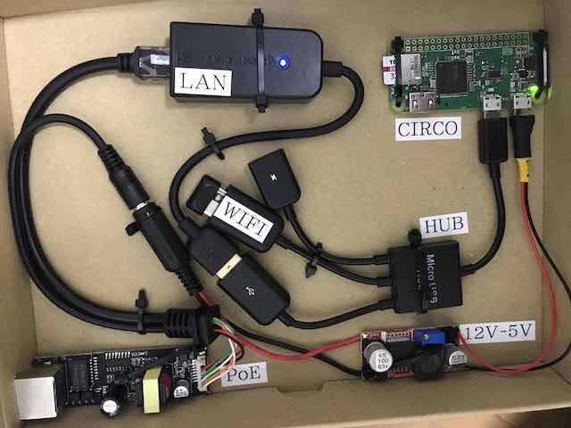

# CIRCO

## Cisco Implant Raspberry Controlled Operations

Designed under Raspberry Pi Zero and aimed for cover red-team Ops, we take advantage of SecNetDevOps tools to capture network credentials in a stealth mode.
Using a low profile hardware/electronics and different methods for credentials exfiltration 
The tools use a combination of honeypots and information gather to lure Automation Systems into reveling network credentials (ssh/telnet/snmp) to our implant.

## Installation

Follow INSTAL.txt file on each directory:

```
/circo_v1/INSTALL.txt
/carap_v1/INSTALL.txt
/jaula_v1/INSTALL.txt
```

----

# Credentials Exfiltration Format

### Telnet
```
t,<user>,<password>
t,e,<enable>
```

### SSH
```
s,<user>,<password>
s,e,<enable>
```

### SNMP
```
p,<community>
```

----

# DEMO

[Demo Video](https://vimeo.com/299122405)

Hostname `jaula` is a Raspberry Pi Zero with Adafruit 2.8" TFT and Buffalo WLI-UC-GNM
dongle (also connect an USB LAN adaptor for mgmt), will be running `jaula_v1.py`

Hostname `carpa` is a Raspberry Pi 3 running DHCP, eth0 connected to Cisco 2960-8TC and
console to the switch, we also run `carpa_v1.py` (this can be on Internet)
From here we can connecto our fake Cisco 3845 switch (circo_v1.py) like an automation system
The onboard wlan0 is used for mgmt

Hostname `circo` is **the** Raspberry Pi Zero W running `circo_v1.py`
We use a Buffalo WLI-UC-GNM dongle for Wireless exfiltration (wlan1) and onboard for 
mgt (wlan0). USB LAN adapter (eth0) connected to the Cisco switch.
The PoE & DC-DC are used to provide power (5V) to the Raspberry

**Demo Enclosure Only**




----

# Presentations

[HIVE AV Tokyo 2018](https://speakerdeck.com/ekio_jp/circo-hive-av-tokyo-2018)


----

# ToDo

- [ ] Make the code nicer
- [ ] Improve performace for snmposter and support *any* community
- [ ] Work on WPAD discovery module 
- [ ] Work on No-DHCP module
- [ ] Wifi Pineapple Module (jaula_v1.py)
- [ ] Include Automation SRC IP in the exfiltration
- [ ] Port code into NodeMCU/Arduino for jaula_v1.py

----

# Author

Emilio / [@ekio_jp](https://twitter.com/ekio_jp)

----

# Licence

Please see [LICENSE](https://github.com/ekiojp/circo/blob/master/LICENSE).
